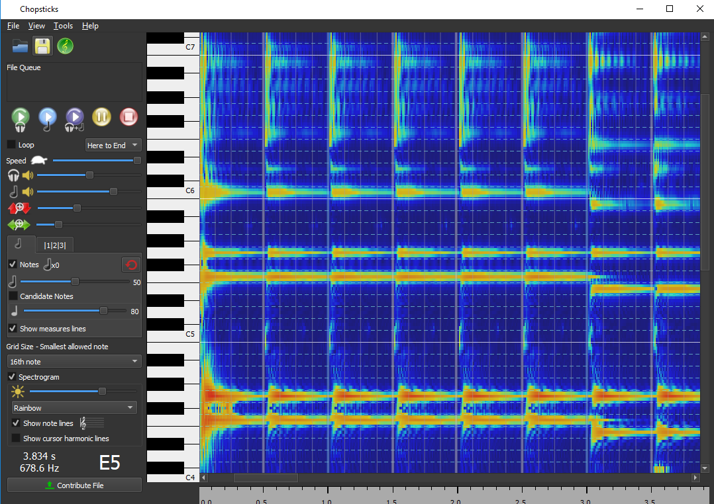

## Video goes here

## Project Summary
2 short sentences each on what we all did 

## Approach
CSP Variables, constraints, optimization function  

Preprossessing (how we started with using AnthemScore) -Kenny  
First, we create audio files to feed AnthemScore and output .csv files. We used MuseScore 3 to make music and then export it as audio files, either MP3 or .wav.

  

After we give AnthemScore the files, we let AnthemScore's neural network decode the amplitudes of each frequency sorted by .01 second frame intervals. Once converted, we input it into our create_note_list function within the music_translator.py file. 

 

Alongside the file_name, we also need to give the function the tempo (beats per minute), the threshold (how loud the amplitude must be to register as a note), the offset (how far away the song's is from time 0 seconds), and leniency (how offbeat the song is from the tempo's beat). After running the function, the function sets up the values, and iterates through all the frames. We check if we want to consider the time interval if it falls within the boundary of tempo ± leniency. For example, if the song has a tempo of 120BPM, an offset of .05, and a leniency of .03, the checker would find and consider the time intervals between .27s and .33s because every eighth note is .25s, offsetting it would make the middle .3s, and the leniency would make it search .03s before and after. If the frame's timestamp is within the tempo ± leniency, then we record the minimum and maximum amplitude for each frequency of the whole interval. Once we leave the boundary of tempo ± leniency, we use a hill-climbing search staring from the lowest frequency to see each peak amplitude. After finding the local peak amplitude (the frequencies below and after have lower amplitudes), we run it through a checker to see if the maximum amplitude is above the weighted threshold. Since MuseScore has higher-pitched notes louder than lower-pitched notes, we weight our threshold so high-pitched notes receive a bigger threshold. After that check, we copmare the minimum and the maximum amplitude of the frequency to determine if it's a new note or a continuation of a previous note. For example at 220Hz, if the minimum amplitude found within the interval is 200 and the maximum is 3000, it most likely is a new note. If the minimum is 2000 and the maximum is 2300, then most likely, it's a continuation and we do not recognize it as a new note. If the frequency passes, we then append a tuple of the frequency and its maximum amplitude to the time_list. We keep checking the interval until the end in case the interval has chords (more than one note playing at the same time). After collecting all the notes, we then sort the notes by amplitude. Once we reach the end of the song, we convert the frequencies to integers that correlate to the Minecraft noteblocks. After conversion, we append each interval into the final note_list where we output the result.  

Baseline Approach (Brute Force) - Alec  
Random Assignment - Kenny  
Greedy Search (Most Optimal) - Rodrigo  
 
## Evaluation
Quick qualitive remark about the sound - Alec  
Optimality (3 graphs) - [No one yet]  
Quality compare CSV files from actual song and minecraft's version) - Rodrigo  
Quick summary of "we solved it" - [No one yet]  

## References
We used AnthemScore to translate audio files into csv files. We also used MuseScore 3 to create music and then export as an audio file for AnthemScore. We used modified Musescore (.mscz) files from user denito (Grenade Bruno Mars) and kenokill (Bad Apple!!).
