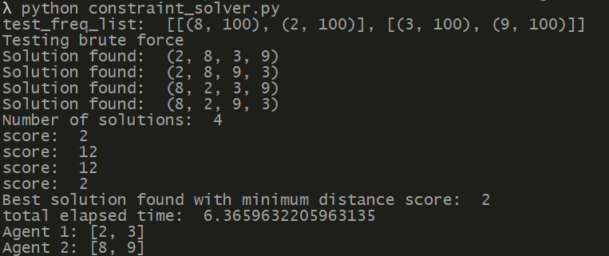
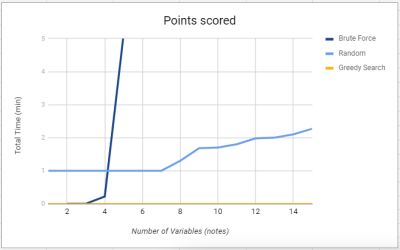
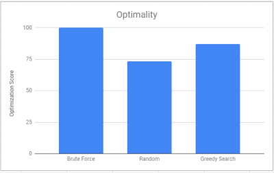

## Video goes here

## Project Summary
For our project, we created an orchestra of AI agents that are capable of listening to music and recreate a song in Minecraft by scheduling each other to hit the appropriate Minecraft noteblocks on time. Our inputs is an audio file (such as .wav or .mp3). The outputs will be the sounds from the noteblocks the AI touches and also a log that tells what the AI hit with the timestamp. Our AI not only tries to play the song as close to the audio file as possible, but the AI will also try to achieve this goal with the fewest amount of steps it can find. We want to simulate a MIDI-like contraption, and with AI, we can play songs without knowing how to play music as efficiently as possible.

## Approach
CSP Variables, constraints, optimization function
With our note frequencies from AnthemScore, we can then frame our problem as a constriant satisfaction problem.

First we pre-process the outpint into a matrix F[t][i] given an amplitude threshold.

Then, our variables would consist of a copy of the processed frequency list into a new matrix called N, where the variable N[t][i] is played by the ith agent at time t.

Each variable's domain depends on the list of notes in F[t] for every given t

Finally, there are two constraints needed. First we must minimize the distance between notes played by each single agent for every adjacent pair of notes with respect to time. 

Second we must make sure each agent plays a different note, so each note variable in a given time t cannot have the same value.

Our naive solution is to brute force the entire domain space for solutions to our constraint, but by the large nature of this domain space this would not be optimal within regular time constraints. Next, we tried to randomly search through the domain space for improvement to our optimization function with a limited number of iterations to reach closer results in a shorter amount of time. Finally, our best solution  is a greedy search algorithm that currently searches for optimal choices per agent while removing previous agent's decisions from domain list until the frequency matrix is empty.

### Preprossessing 
First, we create audio files to feed AnthemScore and output .csv files. We used MuseScore 3 to make music and then export it as audio files, either MP3 or .wav.

  

After we give AnthemScore the files, we let AnthemScore's neural network decode the amplitudes of each frequency sorted by .01 second frame intervals. Once converted, we input it into our create_note_list function within the music_translator.py file. 

 

Alongside the file_name, we also need to give the function the tempo (beats per minute), the threshold (how loud the amplitude must be to register as a note), the offset (how far away the song is from time 0 seconds), and leniency (how offbeat the song is from the tempo's beat). After running the function, the function sets up the values, and iterates through all the frames. We check if we want to consider the time interval if it falls within the boundary of tempo ± leniency. For example, if the song has a tempo of 120BPM, an offset of .05, and a leniency of .03, the checker would find and consider the time intervals between .27s and .33s because every eighth note is .25s, offsetting it would make the middle .3s, and the leniency would make it search .03s before and after.   

If the frame's timestamp is within the tempo ± leniency, then we record the minimum and maximum amplitude for each frequency of the whole interval. Once we leave the boundary of tempo ± leniency, we use a hill-climbing search staring from the lowest frequency to see each peak amplitude.  

 

After finding the local peak amplitude (the frequencies below and after have lower amplitudes), we run it through a checker to see if the maximum amplitude is above the weighted threshold. Since MuseScore has higher-pitched notes louder than lower-pitched notes, we weight our threshold so high-pitched notes receive a bigger threshold. After that check, we copmare the minimum and the maximum amplitude of the frequency to determine if it's a new note or a continuation of a previous note. For example at 349.228Hz (F4 Note), if the minimum amplitude found within the interval is 1300 and the maximum is 7600, it most likely is a new note. If the minimum is 2000 and the maximum is 2300, then most likely, it's a continuation and we do not recognize it as a new note.  

 
 

If the frequency passes, we then append a tuple of the frequency and its maximum amplitude to the time_list. We keep checking the interval until the end in case the interval has chords (more than one note playing at the same time). After collecting all the notes, we then sort the notes by amplitude.   

Once we reach the end of the song, we convert the frequencies to integers that correlate to the Minecraft noteblocks. (see below picture. The numbers correlate the integer numbers to the frequencies)

After conversion, we append each interval into the final note_list where we output the result.  

### Methods
#### Baseline Approach (Brute Force) - Alec  

The baseline approach to solving this problem is to use brute force to exhaustively generate all of the solutions and attempt to find the solution that has the minimum distance score. To implement this algorithm we first preproccess our freq_list(Notes that need to be played) and construct our variables for the CSP using pyGM, each note will become a variable and can hold only one value (the note to be played). Afterwards we construct a model of factors, relationships between variables, that will be used to exhaustively search for all possible combinations of notes that can be played within the constraints of our CSP. We then use this model to search for all possible solutions to the CSP and, using a score function, will calculate the distance traversed by the agents for each solution. We can then iterate through each solution and ultimately obtain the solution with the minimum distance score. 

This method will 100% of the time find the optimal solution because it will calculate every posible configuration of notes given to each agent. It will solve the problem within a reasonable time if the amount of notes is small. The issue however is that the time to find that optimal solution scales quickly as a song contains more notes and requires more notes to be played at the consecutively. In our example our brute force solver was able to find the solution to a 4 note problem in 5 seconds. Yet in comparison for a problem such as 6 notes the brute force solver can take up to 30 minutes to solve that one. Although brute force will return the optimal solution every time, ideally it would be better if we could find that solution in a much shorter time when used for more complex music.

#### Random Assignment
The random assignment search is another strategy that we experimented with. What random assignment does is for every iteration, two agent’s tasks are swapped and then tested to see if the amount of total steps decreased. If the total does not improve, then we swap another two until the iterations run out. Otherwise, we save the new minimum total and use that as progress to find the next step towards a lower minimum.  

Potentially, this could find the minimum better than the brute force option, but as the name implies, the function is random and can even be stuck at a local minimum. At that point, the iterations would be wasted and no progress will be made.  

#### Greedy Search (Most Optimal) - Rodrigo  
 
## Evaluation
In terms of qualitative evaluation, we would like to make a quick remark on the quality of the sound produced by HarmonAI within minecraft. For all the songs used in the project the audio produced within minecraft sounds very close to the audio of the original song. To view this comparison, we compared our best performing music produced by our AI to the original in the video. In addition, below we have included a link to a sample video of our agent as well as an mp3 of the original song. At this point we would also like to address an issue in malmo that caused agents to play slightly off from each other. Since there is no way to synchronize sending commands to multiple agents within malmo we had to settle with sending commands to each agent consecutively. Mostly the agents play in unison, however the issue will only occur occasionally. 

<a href="https://github.com/AlecJacksonE/HarmonAI/blob/master/music/">Music</a>

We had three approaches based on optimality and speed. As can be seen below our Naive brute force method would always find the optimal solution by doing an exhaustive search to find all solutions. It outperforms both the random search algorithm as well as the Greedy search algorithm in terms of optimality. Yet brute force is not without its tradeoffs as it trades optimality with an exponential cost in speed. Brute Force search must exhaustively search for all solutions within the space including sub-optimal ones. This leads to the brute force algorithm performing exceptionally worse than the other two in terms of speed. In comparison the random search algorithm made a huge increase in speed by limiting the number of iterations occurring. The algorithm will continue swapping agents resulting in the agent finding a semi-optimal solution in a fraction of the time of the brute force algorithm. In contrast to brute force the random search algorithm sacrifices its optimality to produce faster results. Lastly, our Greedy search algorithm added heuristics in traversing the search space to increase both average quality and speed.

Speed

Optimality

Quick summary of "we solved it" - [No one yet]  

## References
We used AnthemScore to translate audio files into csv files. We also used MuseScore 3 to create music and then export as an audio file for AnthemScore. We used modified Musescore (.mscz) files from user denito (Grenade Bruno Mars) and kenokill (Bad Apple!!).
