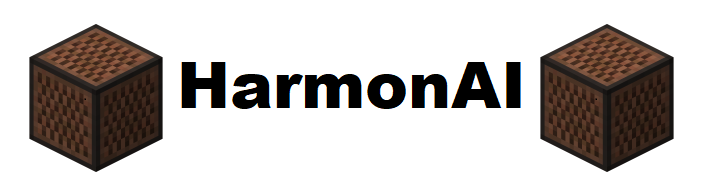
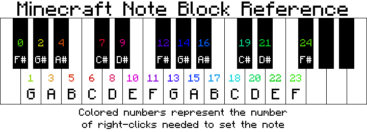
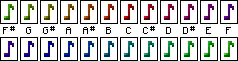
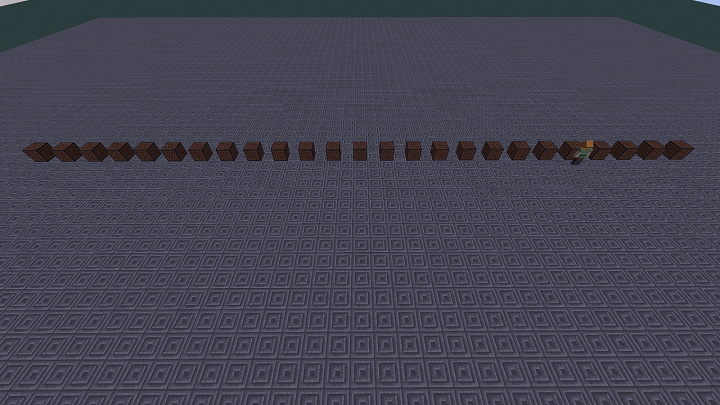

 

HarmonAI is an orchestra of AI agents that can play a sheet of music. Given a .mp3 or .wav file, HarmonAI allows us to recreate a musical piece, by allowing several AI agents to navigate around the world and play the correct noteblock that corresponds to a note in the music.

In minecraft, noteblocks can have one of 24 different semitones. This means minecraft provides two full octaves of notes for our agents to use and recreate the music to be played. Each note can be set by right clicking a noteblock a set amount of times.

Each noteblock can also be identified by the color of the note icon when played.

In order for the agents to hit the correct noteblocks they are given a noteblock_id from 0 to 24 and perform a search on the location of the corresponding noteblock. They then teleport to the noteblock and hit it to play the note. The noteblocks are layed out in a line 
from F#(0) to F#(24).

So how does our project achieve this? We first take the input of the audio file (.mp3 or .wav) and convert it into a csv file using AnthemScore :https://www.lunaverus.com/. AnthemScore utilizes a neural network to convert audio files into csv files that contain information about the file such as tempo, offset, and amplitude threshold. We pick out the frequencies of the greatest amplitude and convert these values into noteblock values (0-24) and save them into a timestamped list. Using this newly generated list we can transform the problem into a constraint satsifcation/optimization problem. The short and sweet of it is we can optimally tell which agents to play which note at each time interval and produce a similar audio output to that of the original song.
  
  

Source code: https://github.com/AlecJacksonE/HarmonAI/code

Reports:

- [Proposal](proposal.html)
- [Status](status.html)
- [Final](final.html)
